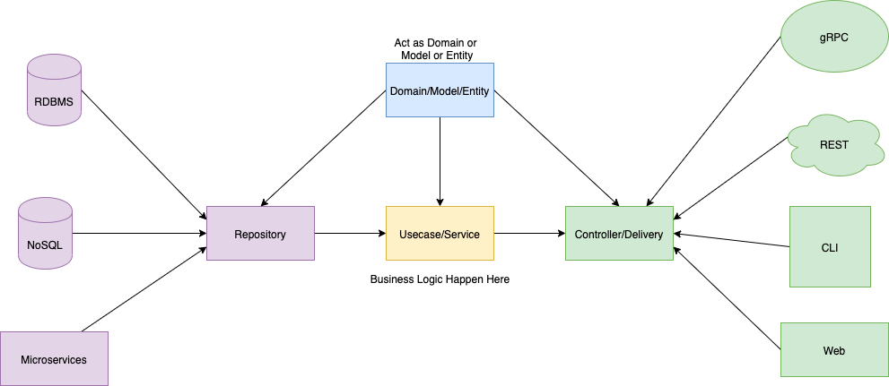

# Golang Clean Architecture
This project is a template for building a Golang project with Clean Architecture. It's following the [Clean Architecture](https://blog.cleancoder.com/uncle-bob/2012/08/13/the-clean-architecture.html) and https://github.com/bxcodec/go-clean-arch.

Rule of Clean Architecture by Uncle Bob:

- Independent of Frameworks. The architecture does not depend on the existence of some library of feature laden software. This allows you to use such frameworks as tools, rather than having to cram your system into their limited constraints.

- Testable. The business rules can be tested without the UI, Database, Web Server, or any other external element.

- Independent of UI. The UI can change easily, without changing the rest of the system. A Web UI could be replaced with a console UI, for example, without changing the business rules.

- Independent of Database. You can swap out Oracle or SQL Server, for Mongo, BigTable, CouchDB, or something else. Your business rules are not bound to the database.

- Independent of any external agency. In fact your business rules simply don’t know anything at all about the outside world.

More at https://8thlight.com/blog/uncle-bob/2012/08/13/the-clean-architecture.html

This project has 4 Domain layer:

- Models Layer 

- Repository Layer

- Usecase Layer

- Delivery Layer

*The diagram:*

## How to start

Start local infrastructure;

```bash
./scripts/bin.sh infra up -d
```

Start API server - local environment

```bash
./scripts/bin.sh api start
```

Start API server - uat environment

Please make sure enable VPN connected before run

```bash
./scripts/bin.sh api dev_start
```

Start worker - local environment

```bash
./scripts/bin.sh api worker_start
```

Stop local infrastructure;

```bash
./scripts/bin.sh infra down
```

Start Golang debugger

Go to VScode, press debugger

## Documentation

This project use Swagger to generate API documentation, the command is below:

```bash
./scripts/bin.sh docs gen
```

To update API documentation, update files *.go in handler folder and run above command again

### Step coding API

The step will be reverse direction of layer dependency: repositories -> usecases -> handlers.

### Rule of thumb

**Single responsibility** function should do one thing and do it well.

## <aname="commits"></a> Git Commit Guidelines

We have very precise rules over how our git commit messages can be formatted.
This leads to **more
readable messages** that are easy to follow when looking through the **project history**.
But also, we use the git commit messages to **generate the change log**.

The commit message formatting can be added using a typical git workflow or through the use of a CLI
wizard ([Commitizen](https://github.com/commitizen/cz-cli)).
To use the wizard, run `yarn run commit` in your terminal after staging your changes in git.

### Commit Message Format

Each commit message consists of a **header**, a **body** and a **footer**.  The header has a special
format that includes a **type**, a **scope** and a **subject**:

```bash
<type>(<scope>): <subject>
<BLANK LINE>
<body>
<BLANK LINE>
<footer>
```

The **header** is mandatory and the **scope** of the header is optional.

Any line of the commit message cannot be longer 100 characters! This allows the message to be easier
to read on GitHub as well as in various git tools.

### Revert

If the commit reverts a previous commit, it should begin with `revert:`, followed by the header
of the reverted commit.
In the body it should say: `This reverts commit <hash>.`, where the hash is the SHA of the commit
being reverted.
A commit with this format is automatically created by the [`git revert`][git-revert] command.

### Type

Must be one of the following:

***feat**: A new feature

***fix**: A bug fix

***docs**: Documentation only changes

***style**: Changes that do not affect the meaning of the code (white-space, formatting, missing semi-colons, etc)

***refactor**: A code change that neither fixes a bug nor adds a feature

***perf**: A code change that improves performance

***test**: Adding missing or correcting existing tests

***chore**: Changes to the build process or auxiliary tools and libraries such as documentation generation

***chg**, **change**: A code change to implement a feature

### Scope

The scope could be anything specifying place of the commit change. For example `logger`,
`redis`, `context`, `errors`, etc...

You can use `*` when the change affects more than a single scope.

### Subject

The subject contains succinct description of the change:

*use the imperative, present tense: "change" not "changed" nor "changes"
*don't capitalize first letter
*no dot (.) at the end

### Body

Just as in the **subject**, use the imperative, present tense: "change" not "changed" nor "changes".
The body should include the motivation for the change and contrast this with previous behavior.

### Footer

The footer should contain any information about **Breaking Changes** and is also the place to
[reference GitHub issues that this commit closes][closing-issues].

**Breaking Changes** should start with the word `BREAKING CHANGE:` with a space or two newlines.
The rest of the commit message is then used for this.

Example:
*feat(cart): implement cart repository
*test(product): add unit test for product handler
*fix(checkout): fix error for payment method
